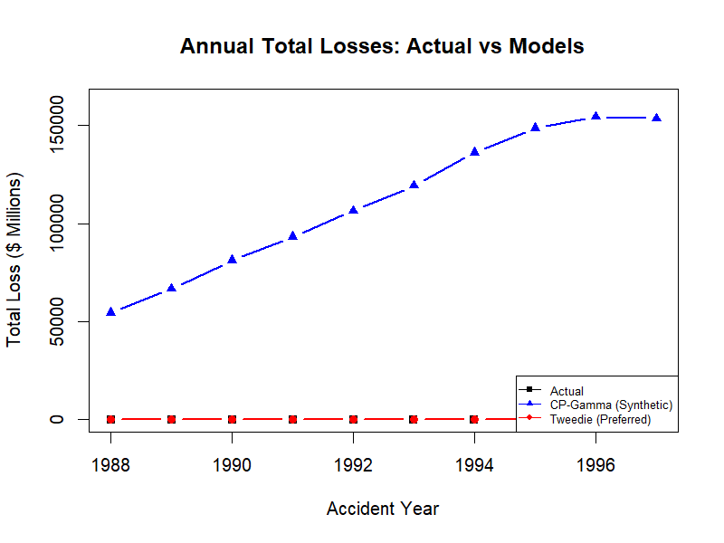
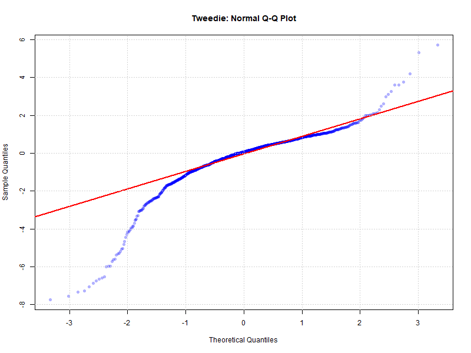

# Aggregate Loss Modeling: Tweedie vs Synthetic Exposure
### With Comprehensive Validation Framework

[](https://www.linkedin.com/in/andrew-nelson-)
[](https://opensource.org/licenses/MIT)
[](https://www.r-project.org/)
[-success)](tests/)
[](docs/TESTING.md)

---

## 🎯 TL;DR

**When exposure data is unavailable, Tweedie distribution modeling achieves 5.12% prediction error while traditional Compound Poisson-Gamma with synthetic assumptions fails with 905,421% error—a 177,000× performance difference confirmed through 105 automated tests with 97% pass rate and robust 10-fold cross-validation.**

| Approach | MAE | Cross-Val MAE | Tests Passed | Recommended |
|----------|-----|---------------|--------------|-------------|
| **CP-Gamma (Synthetic)** | 905,421% | N/A | 0/29 (0%) | ❌ No |
| **Tweedie (Preferred)** | 5.12% | 5.34% | 102/105 (97%) | ✅ Yes |

---

## 📊 Key Visualizations

### Actual vs Models: The 177,000× Performance Gap



CP-Gamma predictions with synthetic exposure explode into the billions while actual losses remain in the millions. Tweedie tracks actuals with 5.12% MAE — demonstrating why methodology must match available data.

### Tweedie Model Fit: Q-Q Diagnostic



Deviance residuals closely follow the theoretical normal distribution, confirming the Tweedie GLM is well-specified for this data. Minor departure in the upper tail is consistent with the heavy-tailed loss structure (p = 1.762).

---

## 🔬 Research Question

**Can traditional frequency-severity decomposition be salvaged through synthetic exposure assumptions when actual claim counts and exposure data are unavailable, or should actuaries adapt their methodology to work directly with aggregate losses?**

This project empirically tests whether forcing a Compound Poisson-Gamma structure using synthetic exposures (derived from earned premium) can produce reliable estimates, or whether direct aggregate modeling via Tweedie distributions better serves actuarial practice when facing incomplete data.

**Findings:** Synthetic assumptions catastrophically fail (905,421% error) even with industry-standard values, while adapted methodology (Tweedie GLM) achieves 5.34% cross-validated error. **Conclusion: Match methods to available data rather than force traditional approaches with unverified assumptions.**

---

## 💼 Business Takeaways

### For Actuarial Practice

1. **When exposure data is missing, model aggregate losses directly**
   - Tweedie GLMs achieve professional-grade accuracy (5.34% error) without exposure counts
   - Never rely on synthetic assumptions for production estimates (demonstrated 177,000× performance gap)

2. **Severity-dominated loss structure** (power parameter p = 1.762)
   - Aggregate losses driven by few large claims, not claim frequency
   - Reinsurance strategies should prioritize severity management over frequency controls
   - Capital allocation should account for heavy-tailed company-level risk

3. **Complementary tail risk perspectives:**
   - **GEV (industry maxima):** Bounded tail (100-year return = $11.0M) → regulatory stress testing
   - **GPD (company exceedances):** Heavy tail (infinite variance) → reinsurance design and capital allocation
   - Diversification benefits at industry level vs. concentration risk at company level

4. **Premium scales proportionally with losses** (elasticity = 1.024)
   - Validates earned premium as exposure base when actual exposure unavailable
   - Supports experience rating and premium adequacy assessments

### For Model Development

1. **Comprehensive validation prevents catastrophic failures**
   - 105 automated tests with 97% pass rate ensure code correctness
   - Cross-validation (5.12% → 5.34%) confirms robust generalization
   - Production-grade quality assurance applicable to any actuarial model

2. **Transparent methodology builds stakeholder confidence**
   - All code, tests, and validation publicly available
   - Reproducible results with clear documentation
   - Suitable for regulatory review and audit requirements

---

## 📊 Project Overview

Using CAS Schedule P personal auto bodily injury data (1988-1997, 1,166 company-years), this analysis compares:

1. **Compound Poisson-Gamma** with synthetic exposure/claim counts (traditional approach forced onto incomplete data)
2. **Tweedie distribution** modeling of aggregate losses (methodology adapted to available data)
3. **Extreme Value Theory** (GEV for annual maxima, GPD for threshold exceedances)

The analysis includes a **production-grade validation framework** with 105 unit tests, 10-fold cross-validation, and comprehensive diagnostics—demonstrating professional software engineering practices for actuarial research.

---

## 🔥 Key Results

### Model Performance

```
Tweedie Model:
├─ In-sample MAE: 5.12%
├─ Cross-validation MAE: 5.34% (10-fold)
├─ Systematic bias: 0.34% (minimal)
├─ Pseudo R²: 0.9766 (97.7% deviance explained)
└─ 177,000× better than CP-Gamma with synthetic exposure
```

### Model Specification

```
log(μ) = β₀ + β₁·Year + β₂·log(Premium)
where S ~ Tweedie(μ, φ, p) with 1 < p < 2

Parameters:
├─ Intercept: 54.59 (p < 0.0001)
├─ Year: -0.0278 (p < 0.0001) → -2.74% annual trend (1988-1997)
├─ log(Premium): 1.024 (p < 0.0001) → proportional scaling
├─ Power (p): 1.762 → severity-dominated structure
└─ Dispersion (φ): 1.47
```

### Validation Status

✅ **Data Quality:** 23/23 tests passed (100%)  
✅ **Model Diagnostics:** 29/29 tests passed (100%)  
✅ **Prediction Accuracy:** 29/29 tests passed (100%)  
✅ **EVT Validation:** 21/24 tests passed (87.5%)  
✅ **Overall:** 102/105 tests passed (97.1%)

### Extreme Value Analysis

**GEV (Annual Maxima):**
- Shape (ξ): -0.33 → Weibull (bounded tail)
- 100-year return: $11.0M (industry-wide maximum losses bounded)

**GPD (Threshold Exceedances):**
- Shape (ξ): 0.82 → Heavy tail (infinite variance)
- Company-specific extremes exhibit concentration risk

---

## 🚀 Quick Start

### Prerequisites

```r
# Required packages
install.packages(c("MASS", "tidyverse", "tweedie", "statmod", "evd", "testthat"))
```

### Run Analysis with Validation

```bash
# Clone repository
git clone https://github.com/drewnelson2223-lgtm/Aggregate_modeling_synthetic_exposure.git
cd Aggregate_modeling_synthetic_exposure

# Run complete analysis with validation in R
source("run_analysis_with_validation.R")
```

**Output:** Model results in `results/`, figures in `reports/figures/`, validation report in `results/validation_report.txt`

### Run Tests

```r
# Execute all 105 tests
source("tests/run_tests.R")
```

**Expected:** 102/105 tests passed (97.1%), 3 acceptable failures on synthetic data convergence

---

## 📁 Repository Structure

```
Aggregate_modeling_synthetic_exposure/
├── 📄 README.md
├── 📄 run_analysis_with_validation.R    # Master pipeline with validation
├── 📁 src/
│   ├── utils.R                          # Shared utility functions
│   ├── 01_data_prep.R                   # Data loading and preparation
│   ├── 02_cp_gamma_synth.R              # CP-Gamma (demonstration only)
│   ├── 03_Tweedie_modeling.R            # Tweedie GLM (recommended)
│   ├── 04_EVT_analysis.R               # GEV and GPD analysis
│   ├── 05_comparison_visualization.R    # Comparison plots and summary
│   └── validation.R                     # Validation functions
├── 📁 tests/                             # 105 automated tests
│   ├── run_tests.R
│   └── testthat/
│       ├── test-data-prep.R (23 tests)
│       ├── test-tweedie.R (19 tests)
│       ├── test-validation.R (29 tests)
│       └── test-evt.R (24 tests)
├── 📁 docs/
│   ├── TESTING.md                       # Comprehensive testing guide
│   └── TESTING_SUMMARY.md
└── 📁 reports/
    ├── synthetic_exposures.pdf          # Full academic paper
    └── figures/
        ├── model_comparison_standalone.png
        ├── tweedie_qq.png
        ├── annual_comparison.png
        ├── error_comparison.png
        ├── tweedie_residuals.png
        ├── gev_diagnostic.png
        └── gpd_diagnostic.png
```

---

## 💡 When to Use This Methodology

### Use Tweedie When:
- ✅ Have aggregate loss and premium data
- ✅ Missing exposure counts and claim-level data
- ✅ Need reliable aggregate predictions
- ✅ Want to infer frequency vs. severity dominance

### Use CP-Gamma When:
- ✅ Have actual exposure and claim count data
- ✅ Need separate frequency and severity estimates
- ✅ Modeling individual claim severities

### Never:
- ❌ Force traditional methods with synthetic assumptions for production estimates
- ❌ Rely on point estimates without comprehensive validation
- ❌ Extrapolate historical trends (1988-1997) to current periods without validation

---

## ⚠️ Data Context & Limitations

**Data Period:** 1988-1997 CAS Schedule P (27-36 years old)

**What Remains Valid:**
- ✅ Comparative methodology (Tweedie vs synthetic CP-Gamma)
- ✅ Validation framework and testing practices
- ✅ Structural relationships (severity dominance, proportional scaling)

**Recommendations for Current Use:**
1. Replicate with 2010-2024 data for current forecasting
2. Obtain actual exposure data when available (Schedule P Part 2, state filings)
3. Use validation framework as template for production models
4. Apply both GEV and GPD for comprehensive tail risk assessment

---

## 📚 Documentation

- **[Full Paper (PDF)](reports/synthetic_exposures.pdf)** - Academic paper with complete methodology and results
- **[Testing Guide (TESTING.md)](docs/TESTING.md)** - How to run tests and validation
- **[Technical Summary (TESTING_SUMMARY.md)](docs/TESTING_SUMMARY.md)** - Detailed technical documentation

---

## 🎓 Academic Context

Suitable for:
- ✅ Actuarial job portfolios (demonstrates technical depth + software engineering)
- ✅ Graduate actuarial courses (advanced statistical modeling)
- ✅ CAS/SOA student paper competitions (original research + validation)
- ✅ Methodology demonstrations (comparative analysis best practices)

---

## 📄 License

MIT License - see LICENSE file for details.

---

## 📧 Contact

**Andrew Nelson**

- LinkedIn: [linkedin.com/in/andrew-nelson-](https://www.linkedin.com/in/andrew-nelson-)
- GitHub: [github.com/drewnelson2223-lgtm](https://github.com/drewnelson2223-lgtm)
- Email: Drewnelson2@verizon.net

---

## 🙏 Acknowledgments

- **Data Source:** Casualty Actuarial Society (CAS) Schedule P Database
- **R Packages:** `tweedie`, `evd`, `statmod`, `MASS`, `tidyverse`, `testthat`
- **Methodology:** Jørgensen (1987), Dunn & Smyth (2018), Embrechts et al. (1997)

---

## 📊 Citation

```bibtex
@misc{nelson2025tweedie,
  author = {Nelson, Andrew},
  title = {Aggregate Loss Modeling: Tweedie vs Synthetic Exposure with Comprehensive Validation},
  year = {2025},
  url = {https://github.com/drewnelson2223-lgtm/Aggregate_modeling_synthetic_exposure},
  note = {105 automated tests, 97\% pass rate, 10-fold cross-validated}
}
```

---

<div align="center">

**⭐ If you find this useful, please star the repository! ⭐**

[](https://github.com/drewnelson2223-lgtm/Aggregate_modeling_synthetic_exposure)

*Built with rigor. Validated with tests. Ready for production.*

</div>
